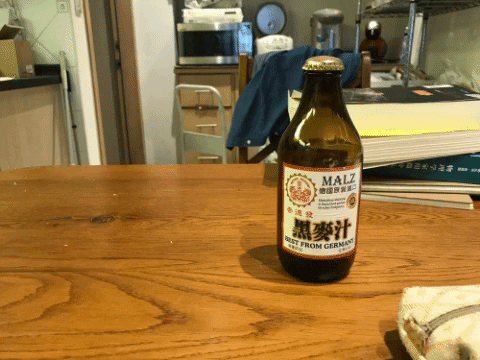
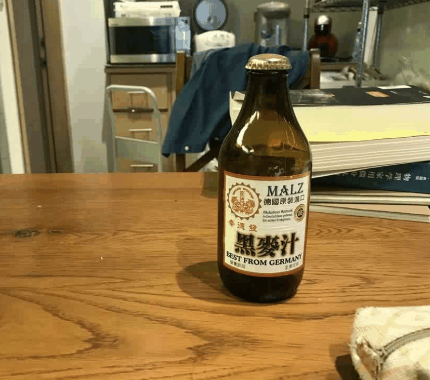

# CVFX-HW5-17
The Multi-View 3D Visual Effects
## Abstract
This assignment want to leverage feature extraction and matching technique using OpenCV to generate some of the multi-view 3D visual effects, such as motion parallax, live photo, and so on. We proposed three 3D visual effects, show the results and more details in below.
## 1. Take multi-view images by yourselves
由於圖片張數以及排版的考量，我們將多張圖片製作成 gif 來呈現。

### a. Motion parallax
> 由 3 張原圖組成的 gif



### b. Stop motion
> 由 5 張原圖組成的 gif


### c. Live photo
> 由 36 張原圖組成的 gif


## 2. Show image alignment results between different images
### Find Keypoints
在找特徵點之前，我們先把圖片轉成灰階來處理。
這裡試用兩種不同方法來找特徵點：**goodFeaturesToTrack** 以及 **ORB**。下面的結果為使用 Shi-Tomasi 角點偵測的結果。

goodFeaturesToTrack 是 Shi-Tomasi 角點偵測，主要是針對 Harris 角點偵測所做的改進演算法，有更多參數可以設定。
第一個參數 image：8 位或 32 位單通道灰度影像；
第二個參數 maxCorners：定義可以檢測到的角點的數量的最大值；
第三個參數 qualityLevel：檢測到的角點的質量等級，角點特徵值小於 qualityLevel 最大特徵值的點將被捨棄；
第四個參數 minDistance：兩個角點間最小間距，以畫素為單位；
第五個引數 blockSize：計算協方差矩陣時視窗大小；

我們定義可以檢測到的角點的數量的最大為 800，這裡找到了 49 個角點，可以觀察到特徵點大部分落在瓶子上，是我們想要的結果：


```python
# Use OpenCV goodFeaturesToTrack()
prev_pts = cv2.goodFeaturesToTrack(prev_gray,
                                     maxCorners=800,
                                     qualityLevel=0.1,
                                     minDistance=30,
                                     blockSize=10)
```
ORB 偵測的部分，我們找到了 4894 個特徵點，特徵點分布在瓶子以及背景上。


```python
# Use ORB 
orb = cv2.ORB_create(5000)
kp , des = orb.detectAndCompute(prev_gray,None)
```
### Calculate Optical Flow
找到每張 frame 的特徵點以後，我們可以透過一種叫 Lucas-Kanade Optical Flow 的方法來計算兩張 frame 之間特徵點的移動，在 OpenCV 中可以透過`calcOpticalFlowPyrLK()`來使用。
```python
# Calculate optical flow (i.e. track feature points)
curr_pts, status, err = cv2.calcOpticalFlowPyrLK(prev_gray, curr_gray, prev_pts, None)
```
但由於有些特徵點在下一個 frame 中不一定 track 得到（可能被遮住或消失），因此我們需要用`status`這個 flag 來過濾掉這些點，只選擇`status`為 1 的特徵點來做計算，再使用`estimateAffine2D`來計算 transformation matrix。

$\begin{align*} T = \begin{bmatrix} \cos \theta & -\sin \theta & x \\ \sin \theta & \cos \theta & y \\ \end{bmatrix} \end{align*}$

計算出 transformation matrix 後，我們可以得出移動軌跡`trajectory`，也就可以反推出每個 frame 需要位移多少量才能得到相機固定的效果。再使用`cv2.warpAffine`對圖片進行仿射變形。

| Before | After |
| -------- | -------- |
| |  |
| |  |
| |  |

另外由於圖片進行仿射變形後，邊緣容易有黑邊，我們使用`cv2.getRotationMatrix2D`來讓每張圖片中心不變，放大 1.04 倍。

### Output GIF
將上述圖片輸出後，使用`imageio.mimsave`來製作 GIF，frame 更新的速度為 0.2 秒，由於邊緣可能還是有黑邊，輸出時會對圖片進行適當裁切。

## 3. Generate the multi-view 3D visual effects
- Motion parallax
> 此 Visual Effect 實作的流程如上題。

Result:



## 4. Exploit creativity to add some image processing to enhance effect
### Image Blurring
Image blurring is simple and frequently used image processing operation. It can reduce high frequencies content from the image, like noises, edges, resulting in edges being blured. Therefore, we perform image smoothing after generating 3D visual effects in order to solve some artifects.

There are many blurring techniques provided by OpenCV. We choose GaussianBlur in OpenCV Python API. Because smoothing by Gaussian is the most commonly used blurring method. 

| Before | After |
| -------- | -------- |
|  |  |

## 5. Bonus - Complete the above 2 different effects
- Stop motion
> 此 Visual Effect 實作的流程如下。
> 1. 良好的拍攝手法
> 2. 將多張圖片以 gif 的方法呈現，播放順序: 1->2->3->4->5->4->3->2->1

由於 Stop motion 是 Motion parallax 的延伸，以及課堂中也有提到關於相機校正 (Camera Calibration) 的作法，像是 Pinhole Camera，所以此視覺效果已透過手機 App 拍攝的方式來完成。攝影軟體 **@picn2k** 的輔助線能夠讓我們調整好相機的仰角確保整個畫面是正的，以及九宮格能將物體對準在畫面相同的位置。

| 正面且對準 | 歪斜 | 仰角 |
| -------- | -------- | -------- | 
|  |  |  |

Result:


- Live photo
> 此 Visual Effect 實作的流程如下。
> 1. Image Alignment
> 2. Crop and paste pixels

如同 Motion parallax 先將原本的 36 張圖片用 ORB 取出 2000 個 feature points, 並利用 optical flow 回推出逼近的 cameara moving path, 並用 warpAffine 反向移動 image, 使得理論上的 camera  moving path 為 0, 以下 gif 為 stable 後的成果。


接著以第一張圖片為基礎, 將流水的部分從後面的圖片取 pixel 值依序貼上代替，最後再將邊框以及整張圖片做 blur 就可以得到最終成品。

Result: 


